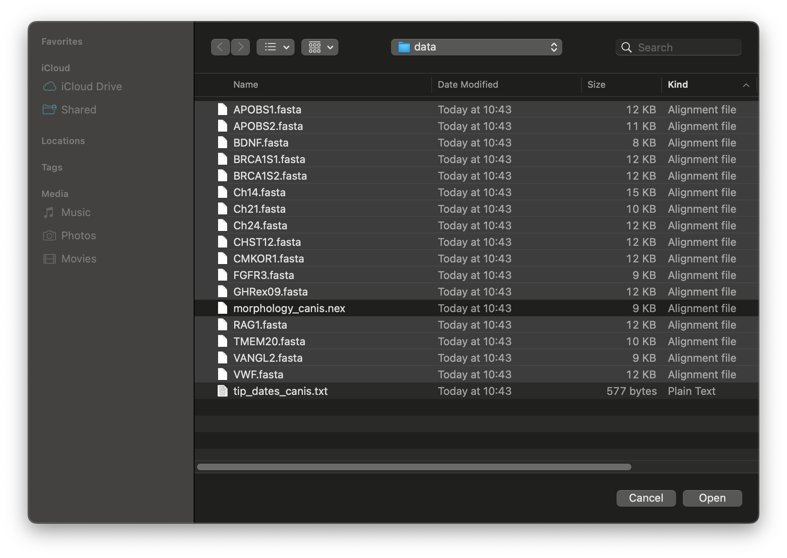
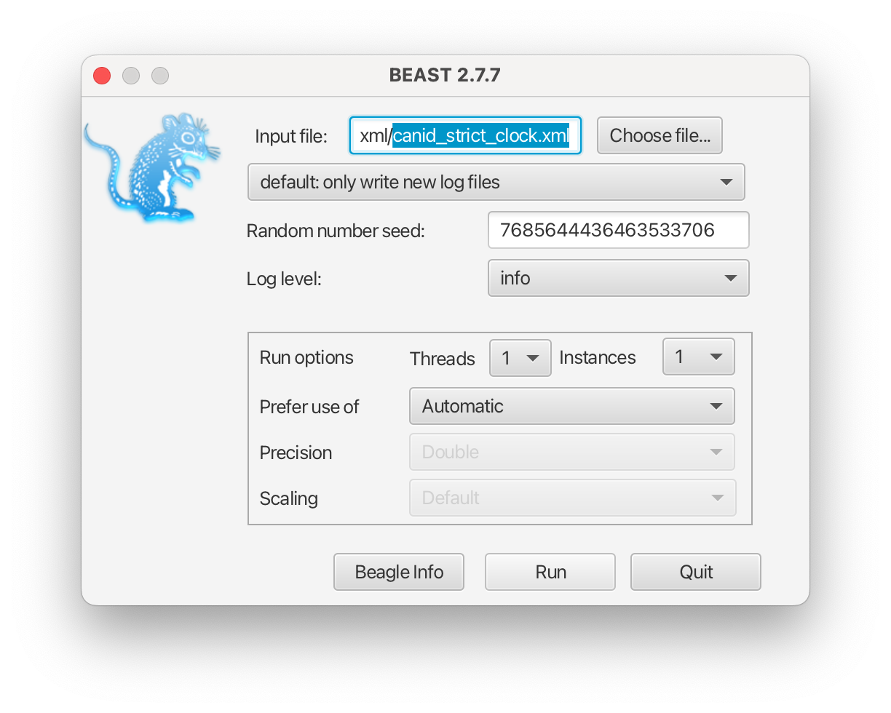
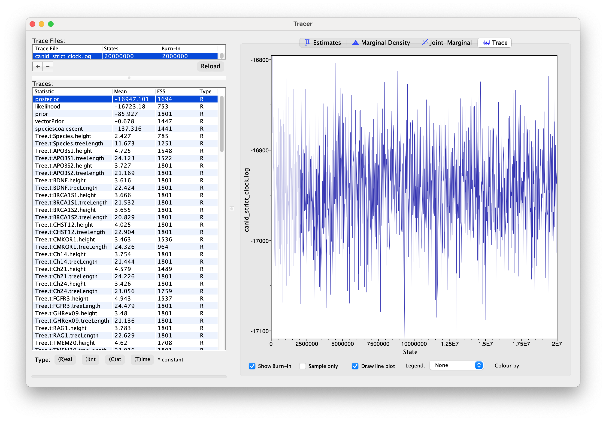
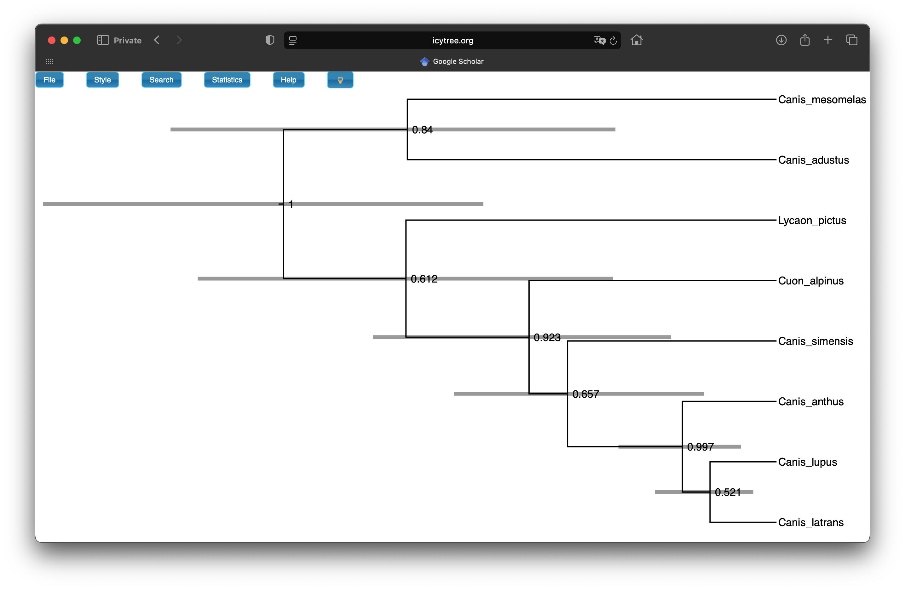
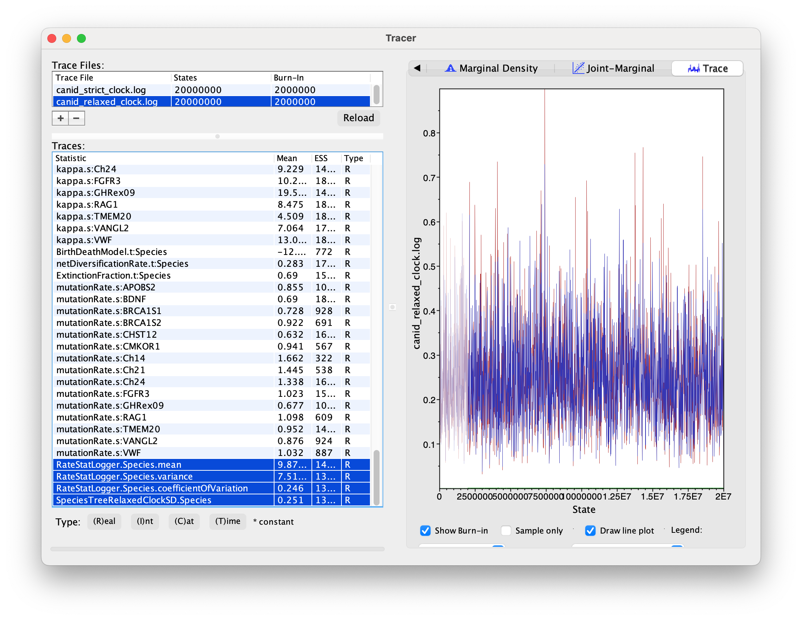

# Background

StarBeast3 is a Bayesian implementation of the multispecies coalescent (MSC) that jointly infers gene and species trees directly from multiple sequence alignments. Trees inferred using this method contain not only topological relationships, but also estimates of species divergences times and gene coalescence times.

This tutorial will walk you through the set up three kinds of species tree analyses using StarBEAST3:

1\. Basic species tree reconstruction using a **strict nuclear clock rate**.

2\. **Relaxed clock** analysis where a separate molecular clock rate is estimated for each species branch.

3\. **Total evidence** analysis where the times and rates and jointly estimated by integrating fossil data into the model.

Note, that here we assume that you already have some knowledge about birth-death and coalescent modes as well as multispecies coalescent.

This tutorial is completely based on the [tutorial for StarBEAST2 by Huw A. Ogilvie](https://taming-the-beast.org/tutorials/starbeast2-tutorial/). If you are citing this tutorial please cite the StarBEAST2 tutorial too.

To avoid repetition, you should read through all parts even if interested in a specific kind of analysis.

# Dataset

In this tutorial we will reconstruct species tree of **Canis** genus. We will analyse 24 species, 8 out which are extant. We will use 16 nuclear loci () for extant taxa in the first two analyses. We will add 50 morphological character data for all 24 taxa for the total evidence analysis. Before starting download all the data for this tutorial. You may browse these data using your preferred alignment viewer before proceeding with the tutorial.

------------------------------------------------------------------------

# Programs used in this Exercise

### BEAST2 - Bayesian Evolutionary Analysis Sampling Trees 2

[BEAST2](http://www.beast2.org) is a free software package for Bayesian evolutionary analysis of molecular sequences using MCMC and strictly oriented toward inference using rooted, time-measured phylogenetic trees . The development and maintenance of BEAST is a large, collaborative effort and the program includes a wide array of different types of analyses. This tutorial uses the BEAST v{{ page.beastversion }}.

### BEAUti - Bayesian Evolutionary Analysis Utility

BEAUti2 is a utility program with a graphical user interface for creating BEAST2 input files which must be written in the XML. This application provides a clear way to specify priors, partition data, calibrate internal nodes, etc.

Both BEAST2 and BEAUti2 are Java programs, which means that the exact same code runs, and the interface will be the same, on all computing platforms. The screenshots used in this tutorial are taken on a Mac OS X computer; however, both programs will have the same layout and functionality on both Windows and Linux. BEAUti2 is provided as a part of the BEAST2 package so you do not need to install it separately.

### LogCombiner

This program helps to combine the output of several MCMC chains. It can discard the initial burn-in and resample the log files at lower frequency.

LogCombiner is provided as a part of the BEAST2 package so you do not need to install it separately.

### TreeAnnotator 

TreeAnnotator is used to produce a summary tree from the posterior sample of trees using one of the available algorithms. It can also be used to summarise and visualise the posterior estimates of other tree parameters (e.g. node height).

TreeAnnotator is provided as a part of the BEAST2 package so you do not need to install it separately.

### IcyTree

IcyTree (https://icytree.org) is a browser-based phylogenetic tree viewer. It is intended for rapid visualisation of phylogenetic tree files.

### UglyTrees

UglyTrees (https://uglytrees.nz) is a browser-based multi-species coalescent trees viewer. It is intended for exploring the posterior space of species tree and embeded gene trees.

### Tracer

[Tracer](http://beast.community/tracer) is used for assessing and summarizing the posterior estimates of the various parameters sampled by the Markov Chain. This program can be used for visual inspection and assessment of convergence and it also calculates 95% credible intervals (which approximate the 95% highest posterior density intervals) and effective sample sizes (ESS) of parameters. We will be using Tracer v{{ page.tracerversion }}.

------------------------------------------------------------------------

# Setting up

## Install StarBeast3 and CCD0 packages

> Begin by launching **BEAUti**.
>
> A the top menu select **File -\> Manage Packages**
>
> The new window with the list of all packages will open. Scroll down the list and select **starbeast3**. Click **Install/Upgrade** to install the package (see [Figure 1](#fig1)). This will also install all the packages StarBeast3 depends on (if not already installed).
>
> Now repeat the step above, but select **CCD** in the package list. This package is not required to run **starbeast3**, but we will use it for tree sumary in this tutorial.
>
> Restart **BEAUti**.

<figure align="center">

 

<figcaption>Figure 1: Install starbeast3</figcaption>

</figure>

# 1. Strict Clock Species Tree Reconstruction

All StarBeast3 analyses require a special BEAUti template to set up.

> Launch **BEAUti**
>
> From the top menu select **File =\> Template =\> StarBeast3**

## 1.1 Data Import

Import the 16 nuclear loci alignments:

> At the bottom of **BEAUti** window, click **+** symbol
>
> In the pop-up window select **Import Alignment** and click **OK**
>
> Navigate to the data folder
>
> Select all 16 loci (all .fasta files) and select **Open** ([Figure 2](#fig2))
>
> You are next prompted to choose the alignment type. Select **"all are neucleotide"** from the dropdown and click **OK**. 
>
> There should now be 16 partitions listed in BEAUti ([Figure 3](#fig3))

<figure align="center">

 

<figcaption>Figure 2: Select all .fasta files.</figcaption>

</figure>

<figure align="center">

 

<figcaption>Figure 3: Loaded molecular data.</figcaption>

</figure>

## 1.2 Taxon Set

Each species in our data sample has two haplotypes *a* and *b*, from the same diploid individual. In datasets involving multiple same-species samples, we may have many haplotypes per species. In our dataset, name of every sample is its species name followed by haplotype indicator. This will allow us to use automation when assigning samples to species.

> Select **Taxon Set** tab in **BEAUti**
>
> At the bottom of the sample list, click **Gues**
>
> Keep **use everything** radio button selected and choose **before last**. Keep symbol as \*\*\_\*\* and click **OK**.

You should now see that every species has two haplotypes assigned to it as in ([Figure 4](#fig4)).

<figure align="center">

 

<figcaption>Figure 4: Taxon set.</figcaption>

</figure>

## 1.3 Tip Dates

We are using only nuclear data from extant samples in this analysis. Therefore you can ignore the **Tip Dates** tab.

## 1.4 Gene Ploidy

> Select **Gene Ploidy** tab

Observe that the default value for all loci is set to 2.0. This is because there are two copies of a locus in each individual for diploid populations, so we scale the effective population sizes by 2.0. If you use any mitochondrial or Y/W chromosomal loci, you should change their ploidy to 0.5, because there is effectively only half as many copies of those molecules as there are individuals (male mitochondrial genomes do not count, as they are not inherited by offspring). The ploidy of X/Z chromosomal loci should be set to 1.5 for the same reason.

## 1.5 Site Model

Now we will set the site model. We will set it up for the first partition and then copy the same prior settings to the remaining partitions.

> Switch to **Site Model** tab
>
> At **Subst Model**, select HKY from the dropdown list.
>
> Check **estimate** checkbox at the **kappa** parameter.
>
> For **Frequencies**, select **empirical** from the dropdown list. It should look like [Figure 5](#fig5).
>
> Now, on the partition list to the left, select all partitions except the first one.
>
> At the **Clone from** drop down list, choose the first partition that you have set up ([Figure 5](#fig5)).

This set up ensures the same but independent site models for each partition. In real analyses, we may want to increase **Gamma Category Count** to a value between 4 and 8. Here, we will skip this step as it's computationally costly.

<figure align="center">

 

<figcaption>Figure 5: Site model.</figcaption>

</figure>

<figure align="center">

 

<figcaption>Figure 5: Copy site model.</figcaption>

</figure>

## 1.6 Clock Model

The clock model assumption of StarBeast3 is that every gene may evolve under it's own clock rate that is relative to the overall species tree clock rate. Therefore, the prior on each gene clock rate should have mean of 1 and not too high variance. If we choose not to estimate per gene clock rates, they default to 1 and all have the overall species tree clock rate.

In this analysis we will estimate relative clock rate for each gene and set the species tree clock rate to 0.001 (based on previous estimate for RAG-1 ). Note, that in real analyses you can rarely avoid estimating the clock rate as it required a lot of a-priori data. Using strict clock is similarly too simplistic for many cases.

> Switch to **Gene Clock Model** tab.
>
> Verify that check marks checked for every partition.
>
> Switch to **Species Clock Model**.
>
> Make sure the **Species Tree Strict Clock** is selected from the drop down menu.
>
> For **Clock.rate** set value of **0.001**. Do not check the **estimate** checkbox.

## 1.7 Priors

We will use birth-death model as species tree prior. Only constant rate coalescent prior is available as gene tree prior in starbeast3.

> Switch to **Priors** tab.
>
> For **Tree.t:Species** select **Birth Death Model** ([Figure 6](#fig6)).
>
> Leave other priors to their default values.

<figure align="center">

 

<figcaption>Figure 6: Tree Prior.</figcaption>

</figure>

Scrolling down through the prior list you can set priors for the different parts of the model:

-   Birth-death model as species tree prior: net diversification rate and extinction fraction.
-   Coalescent model as gene trees prior: effective population size is gamma distributed with shape parameter fixed at 2 and sale is **popMean** parameter. We usually set a hyperprior on the *popMean*. Currently only constant population sizes are available and true effective poplation size mean is actually 2\* *popMean* parameter in BEAUti.
-   Clock rate: relative clock rate for each loci and overall species tree clock rate. Here, we do not estimate species clock rate therefore you do not see a prior for that rate in the list.
-   Substitution model: substitution model parameters (here, kappa parameter for HKY model) and mutation rate for each loci.

## 1.8 MCMC Chain

The length of MCMC chain and frequency of logging will deopend on the complexity of your analysis and you should set it by hand. Sometimes a short run of your xml is needed to understand how much time is spent per million iterations and how quickly your analysis converges. Based on that, you can then adjust the chain length and logging frequency. We already know the reasonable values here. We will also change the names of the log files to match our XML.

> Switch to **MCMC** tab
>
> Set 20 million for **Chain Length**
>
> Expant **tracelog** and change **File Name** to *canid_strict_clock.log*.
>
> Expand **speciesTreeLogger** and change **File Name** to *canid_strict_clock.species.trees*

<figure align="center">

 

<figcaption>Figure 7: MCMC setup.</figcaption>

</figure>

## 1.9 Save and Run The Analysis

You are now done setting up the XML.

> From the top menu select **File =\> Save** and save the xml file **in a dedicated folder**.

Now, we will run the XMl with BEAST2. It may take around 20-25 minutes, you can choose to proceed with so-called precooked runs we provide to analyse the results while you analysis is running. But make sure to verify that your resulting log files are similar to ones we provide at the end of the run.

> Launch **BEAST2**
>
> Provide your saved XML as **Input file**
>
> Click **Run**

<figure align="center">

 

<figcaption>Figure 8: Run BEAST2.</figcaption>

</figure>

## 1.10 Explore The Results in Tracer

The *.log* file produced by BEAST2 can be viewed in **Tracer**. It help you to verify convergence or explore convergence related issues and explore parameter posterior values. You should find your .log and .trees file in the same folder where you saved the XML.

> Launch **Tracer**
>
> Drag and drop *canid_strict_clock.log* on the **Tracer** window ([Figure 9](#fig9)).

Now you should see the posterior values for:

-   different tree statistics such as tree height and length (calculated for each loci as well as the species tree);

-   tree prior and likelihood for each tree;

-   clock and substitution model parameters;

-   birth-death model parameters;

-   coalescent model parameters.

<figure align="center">

 

<figcaption>Figure 9: Strict clock run log in Tracer.</figcaption>

</figure>

Generally, you should aim for effective sample size (ESS) values higher than 200 for every entry in Tracer. In our run we may have not achieved that for **TreeDistance** statistics for each loci. However, these are calculations to help with evaluation of convergence and do not play a role in posterior calculation directly. For real analyses, it is very important that the trace for these statistics has stopped increasing and stabilized.

> Explore parameters and different visualisations of their posterior in **Tracer**. Note where you can find the mean value for each entry as well as its 95% credible interval.

## 1.12 Explore Posterior Trees

### Convergence diagnostic in **UglyTrees**

Our analysis produces a tree for each loci as well as the species tree. Therefore, it is not an easy task to browse though the all posterior trees and understand the relationships between them. We will use [**UglyTrees**](https://uglytrees.nz).

> Go to [UglyTrees](https://github.com/rbouckaert/starbeast3/blob/master/workshop/www.uglytrees.nz) and load *canid_strict_clock.species.trees* as a species tree.
>
> Then load gene trees for all 16 loci (such as **APOBS1.trees**).
>
> Press **Draw Trees.**
>
> In the top left-hand menu, select **Gene Trees** and scroll down to the gene tree list. Here you can select which (or all) gene trees should be displayed.
>
> Use the arrow keys (left and right) to navigate through the posterior chain of estimated trees.

<figure align="center">

 

<figcaption>Figure 10: Explore the tree posterior in UglyTrees.</figcaption>

</figure>

Note that by default, the width of each species tree node is proportional to the effective population size.

> **Question**. Choose to display one or two gene trees. Ralating to the location in the species tree, where do most coalescent events happen for gene trees? Do you spot many/few incomplete lineage sorting events? How would this be influenced by **popMean** parameter prior?

## 1.13 Generating Summary Species Tree

We can combine the posterior species trees into a single tree that tells a a lot about the distribution but is much easier to visualise and comprehend.

One way to summarise the trees is by using the program **TreeAnnotator**. Until recently the *maximum clade credibility* tree (MCC) has been the default summary method in TreeAnotator. To produce MCC trees TreeAnotator takes the set of trees and find the best supported tree by maximising the product of the posterior clade probabilities. It will then annotate this representative summary tree with the mean ages of all the nodes and the corresponding 95% HPD ranges as well as the posterior clade probability for each node. A new point estimate, called a *conditional clade distribution* tree (CCD) has been proposed . It has been shown to outperform MCC in terms of accuracy (based on Robinson-Foulds distance to the true tree) and precision (how different are the point estimates calculated for replicate MCMC chains). CCD methods may produce a tree that would be well supported but has not been sampled during MCMC. This is beneficial for large trees and complex parameter regimes. Since both methods are still widely used, we show how to use them to summarise the posterior tree distribution.

> Importantly, currently we **can not** produce CCD trees reliably for trees including direct sampled ancestor fossils. Therefore, do not use it when **FBD** prior is selected for species tree!

**To save time, you may run just one method and compare it to the other using the example below.**

### Produce MCC Tree

Use settings as in [Figure 11](#fig11) to produce MCC tree. If you are confused about the set up, please refer to [Introduction to BEAST2](https://taming-the-beast.org/tutorials/Introduction-to-BEAST2/) tutorial.

<figure align="center">

 

<figcaption>Figure 11: Producing MCC summary tree.</figcaption>

</figure>

### Produce CCD Tree

Use settings as in [Figure 12](#fig12) to produce CCD tree. If you are confused about the set up, please refer to [Introduction to BEAST2](https://taming-the-beast.org/tutorials/Introduction-to-BEAST2/) tutorial.

<figure align="center">

 

<figcaption>Figure 12: Producing CCD0 summary tree.</figcaption>

</figure>

### Visualise Summary Tree

We will use [IcyTree](https://icytree.org) to visualise the summary tree (this can be either MCC or CCD tree). You may also use other software, such as [FigTree](https://github.com/rambaut/figtree/releases).

> Open <https://icytree.org> in your preferred browser
>
> Drag and drop either MCC or CCD summary tree.

At the top left hand menu you can choose many visualisation options. We will display 95% highest posterior density for node heights and posterior support for each clade:

> Select **Style =\> Node height error bars =\> height_95%\_HPD**
>
> Select **Style =\> Internal node text =\> posterior**
>
> Select **Style =\> Label precision limit =\> 3 sig. figures**

Now your figure should look similar to [Figure 13](#fig13).

<figure align="center">

 

<figcaption>Figure 13: Visualising summary tree in IcyTree.</figcaption>

</figure>

> **Question**. One of the CCD0 summary method advantages is that it can evaluate tree topologies that were not sampled during the MCMC. In which scenario MCC and CCD0 trees would be (almost) the same? Does it then make sense that our dataset MCC and CCD0 summary tree topologies and clade posterior supports are practically identical?

# 2. Relaxed Clock Species Tree Reconstruction

Now we will execute the same analysis as above, except we will use relaxed clock model that is allowing clock rate to vary accross lineages. 

## 2.1 Edit xml to relax the clock
> Open BEAUti
>
> At the top menu select **File => Load** and select the XML we previously created: _canid_strick_clock.xml_.

We will change the species tree clock model

> Switch to **Species Clock Model** tab
>
> Select **Species Tree Relaxed Clock** from the dropdown menu
>
> Set **Clock.rate** to 0.001 ([Figure 14](#fig14))

<figure align="center">

 

<figcaption>Figure 14: Setting fixed mean for relaxed clock.</figcaption>

</figure>

Let's set chain length and meaningful log filenames:

> Switch to **MCMC** tab
>
> Set 20 million for **Chain Length**
>
> Expant **tracelog** and change **File Name** to *canid_relaxed_clock.log*.
>
> Expand **speciesTreeLogger** and change **File Name** to *canid_relaxed_clock.species.trees*
>
> Save your new xml **in a dedicated folder** by selecting **File => Save as** and select an appropriate name: _canid_relaxed_clock.xml_

## 2.2 Optional: estimating the clock rate

We will not estimate the mean clock rate here to run the analysis faster. However, if you wish to do so, follow these steps:

> In **Species Clock Model** tab, check **estimate** checkbox nect to **Clock.rate**
> 
> Switch to the **Priors**
>
> Assign a _LogNormal(M=0.001, S=1)_ prior to **SpeciesTreeRelaxedClockRate.Species**. Ensure that **Mean in Real Space** is cheked ([Figure 15](#fig15)).

<figure align="center">

 

<figcaption>Figure 15: Relaxed clock mean prior.</figcaption>

</figure>

Let's set chain length and meaningful log filenames:

> Switch to **MCMC** tab
>
> Set 20 million for **Chain Length**
>
> Expant **tracelog** and change **File Name** to *_canid_relaxed_clock_estimated.log*.
>
> Expand **speciesTreeLogger** and change **File Name** to *_canid_relaxed_clock_estimated.species.trees*
>
> Save your new xml **in a dedicated folder** by selecting **File => Save as** and select an appropriate name: _canid_relaxed_clock_estimated.xml_

## 2.3 Run The Analysis

Now, we will run the XMl with BEAST2. This analysis may take a bit longer than the previous one. To analyse the results while you analysis is running, you can choose to proceed with so-called _precooked_ runs we provide. However, make sure to verify that your resulting log files are similar to ones we provide at the end of the run.

> Launch **BEAST2**
>
> Provide your saved XML as **Input file**
>
> Click **Run**

## 2.4 Explore Analysis in Tracer

To verify convergence and explore the recovered parameter priors, load the .log file to Tracer:

> Launch **Tracer**
>
> Drag and drop *canid_relaxed_clock.log* on the **Tracer** window.

Scroll down in the parameter list, you should notice new parameters describing the empirical mean, variance, coefficient of variation of the estimated per-branch rates as well as the standard deviation parameter to the uncorrelated relaxed clock of the species tree ([Figure 16](#fig16)).

 

<figcaption>Figure 16: View log for relaxed clock analysis in Tracer.</figcaption>

</figure>

Here, the value of the coefficient of variation indicated that branch rates are spread moderatelly but not too distant from the mean. 

# 3. Total Evidence Dating

Finally, StarBeast3 is capable of leveraging the fossil record and associated morphological data for **total-evidence analysys**. In this case we will use fossilized birth-death (FBD) model () as species tree prior in the MSC process. Since adding both morphological and molecular data can be complicated within BEAUti, you must follow the steps in order they are given.

## 3.1 Adding Fossils and Morphological Data

> Launch BEAUti
>
> Switch to **Partitions** tab
>
> Repeat the steps you did before to load molecular data in .fasta files

Before you can import morphological data, you must **first set up the Taxon Set and adjust Tree Prior.** 
The taxon set is set up the same way as before ([Figure 4](#fig4)).

> Switch to **Taxon Sets** tab
> 
> Select **Guess**
>
> Select **split on character**, leave the character as "_" and select groups "1-2"
> 
> Switch to **Priors** tab
> 
> From drop down list, select **FBDModel** ([Figure 17](#fig17))

 

<figcaption>Figure 17: Set FBDModel as Tree Prior.</figcaption>

</figure>

Now, we can add the morphological data. You will be prompted to decide if Lewis MK or MKv model should be used. 
Our data contains only variable characters, therefore we will use MKv model. If you would like to know more, the MKv model is discussed in detail at [Total Evidence Tutorial](https://taming-the-beast.org/tutorials/Total-Evidence-Tutorial/).

> Switch back to **Partitions** tab
> 
> Slect **+** symbol at the bottom left menu
> 
> Slect **Add Morphology to Species Tree**
>
> Navigate to the provided data file _morphology_canis.nex_
>
> Now, you are promted to use MKv model. Click **Yes**.

Morphological data should now appear within the **Partitions** tab, [Figure 18](#fig18).

 

<figcaption>Figure 18: Add morphological data.</figcaption>

</figure>

## 3.2 Setting Up Taxon Sets

Even though we already visited this tab after adding molecular data, we need to repeat this step in order to refresh taxon set and include fossil taxa that only contains morphological data.

> Switch to **Taxon Sets** tab
> 
> Repeat the steps above to "Guess" the taxa

## 3.3 Setting Up Tip Dates

This analysis includes samples through time (fossils), therefore we have to inform our analysis about their dates. 

> Switch to **Tip Dates** 
>
> Check **Use tip dates**
>
> At "Data specified as:" row, select **year**, **Before present**
>
> Then select **Auto-configure** 
>
> Toggle **read from file**, select **Browse** and navigate to provided file _tip_dates_canis.dat_
>
> Click **OK**

The tab should now look like [Figure 19](#fig19).

 

<figcaption>Figure 19: Set tip dates.</figcaption>

</figure>

## 3.4 Setting Up the Site Model

We are dealing with the same diploid population as before, therefore you don't need to change anything at **Gene Ploidy** tab. We will now set the site models. The same steps as before apply to molecular data.

> Switch to **Site Model**
> 
> Select first molecular partition (at the top of partitions list)
> 
> For **Subst Model**, select **HKY** from the drop-down list
> 
> Select **Empirical** for **Frequencies**
> 
> Now, select the other molecular partitions and copy the model from the first one

For morphological data, we will not change the default model. Select one of the morphological partitions and verify that the **Subst Model** is **Lewis MK** (ascertainment correction will not be shown here) and it looks like [figure 20](#fig20).

 

<figcaption>Figure 20: Set tip dates.</figcaption>

</figure>

## 3.5 Setting Up the Clock Model

As before, you do not need to change anything for **Gene Clock Model** partition. We will estimate the species tree clock rate, but will use strict clock so that analysis converges faster. 

> Switch to **Species Clock Model** tab
>
> Verify that the **estimate** check box is selected

Only strict clock is available thruough BEAUti for morphological data. We will set it up in the **Priors** tab.

## 3.6 Setting Up the Priors

In the very first step we have already selected **FBDModel** as species tree prior. Note, that we do not need to change the default settings for this analysis. However, if you need to change or estimate sampling at present probability or conditioning, you must do it here.

Let's specify the species clock rate prior:

> Navigate to the **SpeciesTreeStrictClockRate** parameter
>
> Select **LogNormal** from the drop down list and expand the section
>
> Set M=0.001 and S=1.0 and check the **Mean In Real Space** checkmark ([Figure 21](#fig21)).

 

<figcaption>Figure 21: Set species clock prior.</figcaption>

</figure>

Now we will set the prior for strict clock rate of morphological data:

> Navigate to **clockRate.c:morphology_canis** parameter
>
> Select **1/X** from the drop down list ([Figure 22](#fig22)). 

 

<figcaption>Figure 22: Set morphological clock prior.</figcaption>

</figure>

## 3.7 Running the Analysis

You are ready to set up the names of your files, run length and logging frequency.
We used name _canid_FBD_ for all log and tree files. The analysis which results are provided in the pre-cooked runs was run for 10^8 iterations and logged every 3*10^3 iterations. This results in about 2.5-3 hour runtime. You may therefore run the analysis for shorter time to make sure it works and explore the results from the log files we provide. 

## 3.8 Exploring the Results

As before, you may open and explore the trace _.log_ file in Tracer, uglytrees.com and icytree.org. See sections 1.10 through 1.12. The section 1.13 guides you on how to make a summary tree. Now make one for the FBD analysis. 

Finally, load the trees from section 1 and section 3 in FBD and compare. 

> Question: Can you identify any diferences in clade support? 

You should find that the tree topology is largely similar. However, the species _Cuon alpinus_ and _Lycaon pictus_ are now completely supported in by the FBD analysis, while it is not the case when we use only molecular data in section 1. This discrepancy has been previously reported ().   

> Question: Can you identify any diferences in clade height?

We can only compare the clades comprised of extant taxa. However, we do see differences in the MRCA of the extant taxa and, for example, the divergence time between _Canis lupus_ and _Canis latrans_.

# Good To Know 

- To facilitate easy use of uglytrees, the species and individual names should have a similar pattern so that uglytrees can guess the matching automatically, e.g., individual names should contain the species name as a substring, or before the first \_ etc.
- StarBeast3 does allow you to sample tip dates. You can find more information on how to set it up through BEAUti here: <https://github.com/rbouckaert/starbeast3/tree/master/workshop>. 
- You may also use relaxed clock for morhological data, instead of a strict one. However, at the moment this requires to edit the XML by hand. Make sure you are using appropriate _species_ tree clock from the StarBeast3 package. Also, be careful to not include any operators that would break the dependence between species and gene trees. 
- If you are comparing StarBEAST2 and 3 for your analyses you may notice that StarBeast3 is slower per-iteration, but in many cases reaches convergence faster when measured in wall-clock time. 

# Useful Links

-   [Bayesian Evolutionary Analysis with BEAST 2](http://www.beast2.org/book.html) 
-   BEAST 2 website and documentation: <http://www.beast2.org/>
-   StarBeast3 repository: <https://github.com/rbouckaert/starbeast3/tree/master>
-   Join the BEAST user discussion: <http://groups.google.com/group/beast-users>

------------------------------------------------------------------------

# Relevant References


